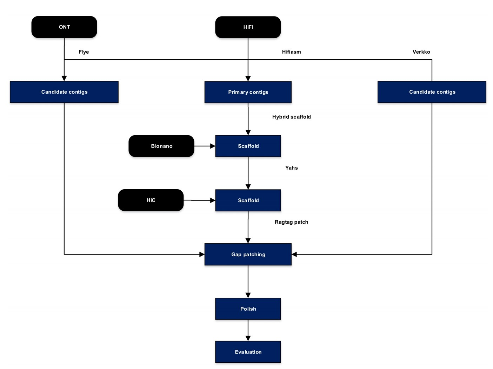

.. SPART documentation master file, created by
   sphinx-quickstart on Thu Oct 12 17:50:51 2023.
   You can adapt this file completely to your liking, but it should at least
   contain the root `toctree` directive.

SPART
=================================
SPART, a Semi-automated pipeline for assembling reference sequence of telomere-to-telomere (T2T).

Quick install and start
~~~~~~~~~~~~~~~~~~~~~~~~~~~~~~
.. toctree::
   :maxdepth: 2

   README

Run step by step
~~~~~~~~~~~~~~~~~~~~~~~~~~~~~~
.. toctree::
   :maxdepth: 2

   README1
